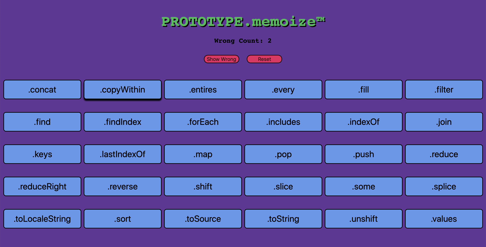
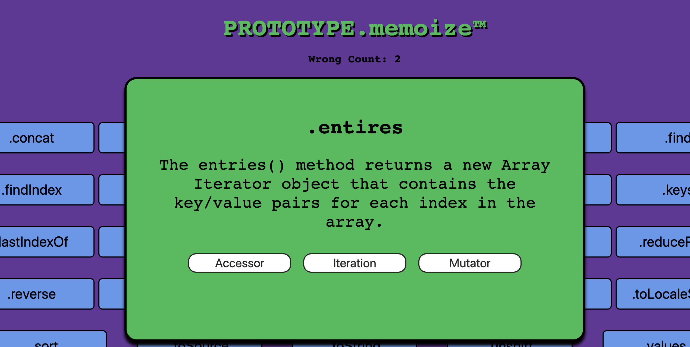
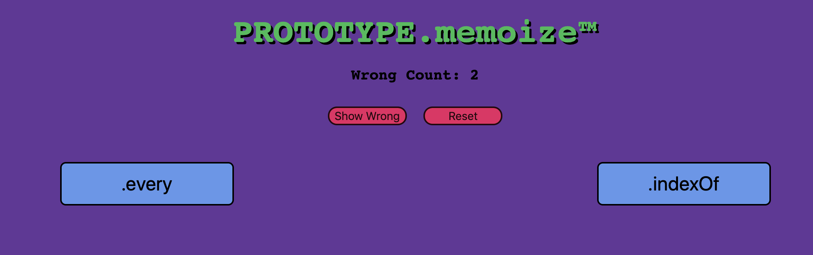

# Prototype.memoize
- By Duy Vu

## languages used:
- React
- Sass

## installation: 
- npm install
- npx create-react-app

# Description

Using React I created a flash card quizzing app to help CompSci students learn about array prototypes. My app allows the user to study prototypes and answer whether they believe the prototype method is an Accessor, Iteration, or Mutator method using buttons provided. If the user is to get a question wrong they will have a chance to revisit their wrongly answered questions by pressing the "Show Wrong" button. If the question is answered correctly the prototype card will be taken out of the wrong list.

## My-Project

